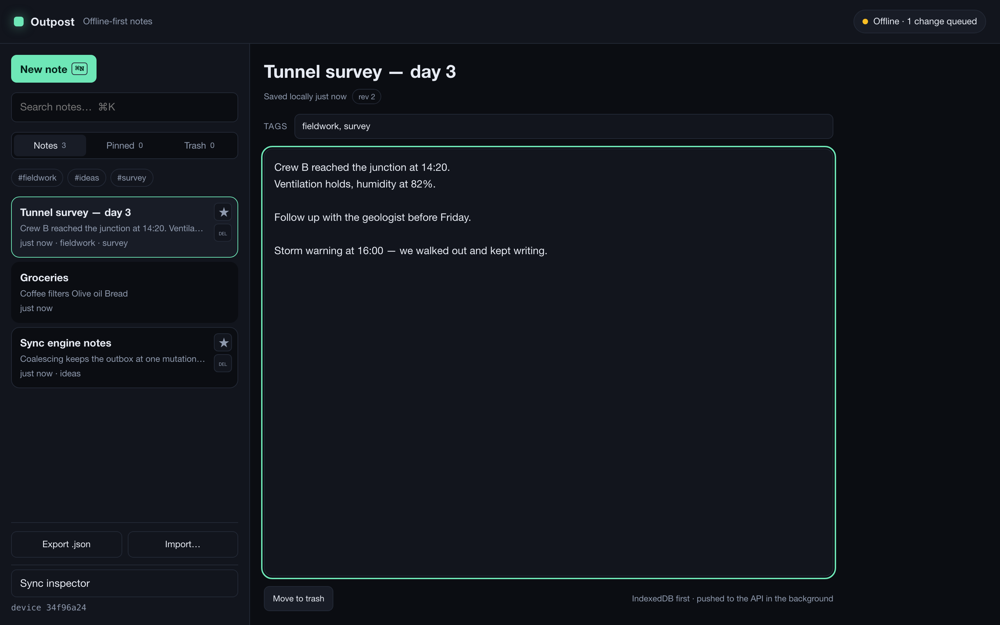
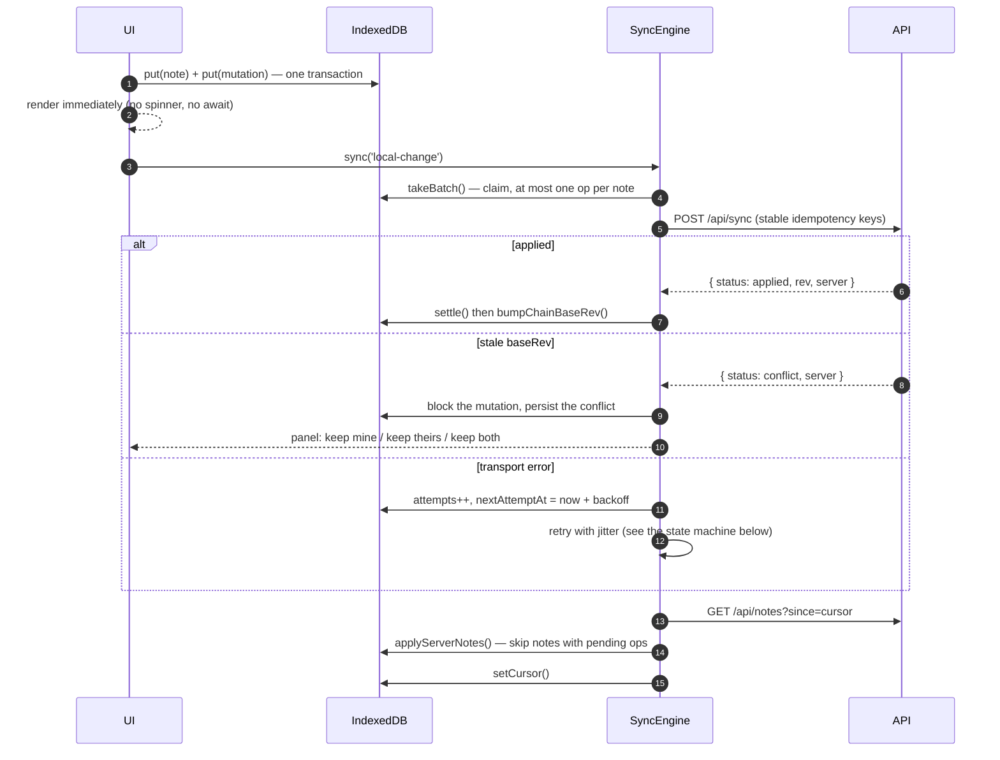
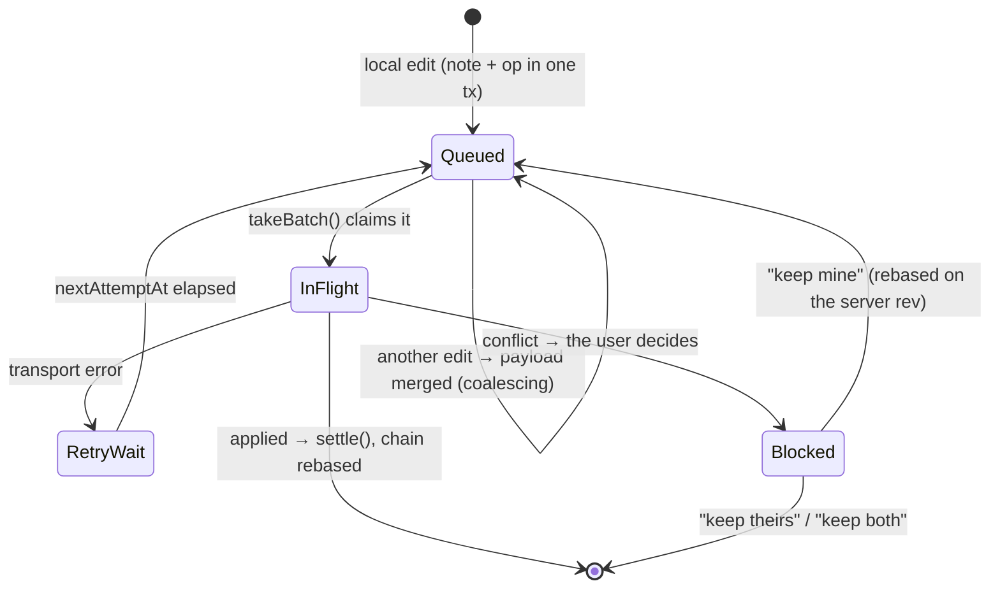
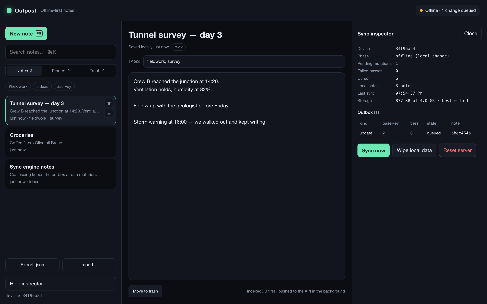

# Outpost

**Offline-first notes that never lose an edit.**

Write with the plane mode on. Close the tab. Come back two hours later in a
tunnel. When the network returns, the app drains its own queue, pulls what the
other devices did, and — when the same note was edited twice — refuses to guess
which version you want to keep.

This is a small app on purpose. It exists to demonstrate the part that is
genuinely hard: **client-side sync**, done explicitly instead of outsourced to a
library.

<p align="center">
  
</p>

<!-- Replace `USER` with your GitHub account when you publish: this is the only
     badge that needs an owner; the rest resolve on their own. -->

[](../../actions/workflows/ci.yml)
[](LICENSE)
[](https://nodejs.org)
[](#tech-stack)

## Contents

- [What is actually hard here](#what-is-actually-hard-here)
- [Start here: the three files that matter](#start-here-the-three-files-that-matter)
- [Features](#features)
- [Quick start](#quick-start)
- [How the sync actually works](#how-the-sync-actually-works)
- [Repository layout](#repository-layout)
- [Tech stack](#tech-stack)
- [Testing](#testing)
- [Debugging the sync pipeline](#debugging-the-sync-pipeline)
- [Scripts](#scripts)
- [Known limitations (honest list)](#known-limitations-honest-list)
- [Roadmap](#roadmap)
- [Engineering notes: the bugs behind the code](docs/engineering-notes.md)

---

## What is actually hard here

Most "offline apps" stop at a service worker that caches the shell. That is the
easy 10%. The remaining 90% is what this repository is about:

| Problem                                                                 | How this repo solves it                                               |
| ----------------------------------------------------------------------- | --------------------------------------------------------------------- |
| Edits made offline must survive a crash, a reload and a browser restart | Note and mutation are written in **one IndexedDB transaction**        |
| 40 keystrokes must not become 40 mutations                              | **Mutation coalescing** (one pending mutation per dirty note)         |
| A retry after a lost response must not duplicate a change               | **Idempotency keys** + a server-side applied-mutation ledger          |
| Two devices editing one note must not silently overwrite each other     | **Optimistic `rev` check** returning `conflict`, resolved by the user |
| A deleted note must not be resurrected by another device's pull         | **Tombstones** (`deletedAt` is a normal synced field)                 |
| A delta pull must not skip rows written in the same millisecond         | **Monotonic `seq` cursor**, not a timestamp                           |
| A sync bug must be visible, not silent                                  | **Sync inspector**: outbox contents, cursor, backoff counters         |

The full reasoning lives in [`docs/adr`](docs/adr):

- [ADR 001 — Outbox pattern with mutation coalescing](docs/adr/001-outbox-pattern.md)
- [ADR 002 — Conflicts are resolved by the user, not by a policy](docs/adr/002-conflict-resolution.md)
- [ADR 003 — Delta sync with a monotonic sequence cursor](docs/adr/003-monotonic-cursor.md)

The bugs behind this code — including one where every unit test was green while the
shipped server could not even start, and one where the test double told the app to
keep a deleted note in the trash — are written up in
[`docs/engineering-notes.md`](docs/engineering-notes.md).

## Start here: the three files that matter

Everything else is plumbing. If you have ten minutes, read these three — in this
order:

| File                                               | What to look for                                                                                       |
| -------------------------------------------------- | ------------------------------------------------------------------------------------------------------ |
| [`app/src/db/repo.ts`](app/src/db/repo.ts)         | the outbox: note + mutation in one transaction, mutation coalescing, batch claiming, revision chaining |
| [`app/src/sync/engine.ts`](app/src/sync/engine.ts) | the loop: push in passes, settle the results, park conflicts, back off, delta pull                     |
| [`server/src/db.ts`](server/src/db.ts)             | the contract: optimistic `rev` check, idempotency ledger, tombstones, monotonic `seq` cursor           |

Two more for context: [`packages/shared/src/index.ts`](packages/shared/src/index.ts)
is the entire wire protocol (types only, shared by both sides), and
[`docs/engineering-notes.md`](docs/engineering-notes.md) is the story of the bugs
those files survived.

## Features

- **Local-first CRUD** — title, body, tags, pin, trash with soft delete and
  restore, all instant, all offline.
- **JSON backup** — export every note to a dated file and import it back through
  the ordinary local-change pipeline, so a restored note syncs (and can conflict)
  exactly like a typed one. A malformed file is rejected whole, never half-applied.
- **Debounced autosave** that merges concurrent field edits instead of dropping
  them, and flushes when you switch notes.
- **Full-text local search** (case- and diacritics-insensitive) over title, body
  and tags, plus tag filters.
- **Sync engine** with exponential backoff + jitter, retry anchors that survive
  reloads, and coalesced passes.
- **Conflict resolution UI** showing both versions side by side: _keep mine /
  keep theirs / keep both_.
- **Multi-tab live updates** through `BroadcastChannel`.
- **Installable PWA**: hand-written service worker with a build-time precache
  list, `skipWaiting` + `clients.claim()`, persistent-storage request, and
  Background Sync (Chromium) that wakes the app when the network returns.
- **Sync inspector** in the UI: phase, cursor, outbox table, storage quota,
  destructive dev buttons.
- **Keyboard-first**: `⌘K` search, `⌘N` new note, `⌘I` inspector.
- **Accessible by default**: labelled controls, `aria-pressed` / `aria-current`
  states, `role="alertdialog"` for conflicts, visible focus rings,
  `prefers-reduced-motion` respected — and **enforced** by `axe-core` in the test
  suite over the WCAG A/AA rule set.

## Quick start

```bash
npm install
npm run dev
```

**Node 24 is required** (CI, the Docker image and the devcontainer all run it):
the API uses `node:sqlite`, which ships inside the runtime, so there is no native
module to compile and no database to install.

- App: <http://localhost:5173>
- API: <http://localhost:8787/api/health>

### Or with zero local setup (GitHub Codespaces)

Click **Code → Codespaces → Create codespace on main**. The
[devcontainer](.devcontainer/devcontainer.json) installs the dependencies, the
Playwright browser and opens the app in a browser tab for you. Then run
`npm run dev` in the terminal it gives you.

### Or with Docker (no local Node needed)

```bash
docker compose up --build
# → http://localhost:8080
```

The `web` container serves the built PWA and proxies `/api` to the `api`
container, so everything runs on a single origin.

### Try the actual offline flow

1. `npm run dev` and open the app.
2. DevTools → Network → **Offline**. The badge turns amber: _Offline_.
3. Press `⌘N` and write a note. The badge becomes _Offline · 1 change queued_ —
   keystrokes are merged into a single mutation, watch it in the inspector (`⌘I`).
4. Reload the page. The note is still there; it came from IndexedDB.
5. Network back **Online**. The outbox drains and the badge goes green.
6. Open the app in a second browser profile: the same note is there. It arrived
   through the API, not through a websocket.

To provoke a conflict by hand, while the app holds a pending edit on a note:

```bash
curl -X POST http://localhost:8787/api/sync -H 'content-type: application/json' -d '{
  "deviceId": "curl",
  "mutations": [{
    "id": "manual-1", "noteId": "<note-id>", "kind": "update",
    "baseRev": 1, "createdAt": 1,
    "payload": { "title": "Changed by somebody else", "body": "",
                 "tags": [], "pinned": false, "deletedAt": null }
  }]
}'
```

Bring the network back: the app parks its mutation and opens the conflict panel
with both versions.

## How the sync actually works

```
┌──────────────────────── browser tab ────────────────────────┐
│  UI ──── reads/writes ────► IndexedDB ──── reads ────► UI    │
│                               │ notes                        │
│                               │ outbox  (mutations)          │
│                               │ meta    (cursor, deviceId)   │
│                               ▼                              │
│                          SyncEngine                          │
│   ┌────────────────────────────────────────────────────┐     │
│   │ 1. takeBatch()          coalesced, claimed ops     │     │
│   │ 2. POST /api/sync       batch + idempotency keys   │     │
│   │ 3. settle()             applied | conflict | failed│     │
│   │ 4. bumpChainBaseRev()   keep the queue consistent  │     │
│   │ 5. GET /api/notes?since=cursor    delta pull        │     │
│   └────────────────────────────────────────────────────┘     │
└──────────────────────────────────────────────────────────────┘
                            │ fetch
┌───────────────────────────▼──────────────────────────────────┐
│ Hono on node:sqlite                                          │
│  notes(id, title, body, tags, pinned, deleted_at, rev, seq)  │
│  applied_mutations(id, note_id, applied_at)   ← idempotency  │
│  counters('seq')                              ← delta cursor │
└──────────────────────────────────────────────────────────────┘
```



The outbox itself is a small state machine — and the reason a queue of 40 keystrokes
collapses into one mutation:



The API has four endpoints and no business logic beyond these rules:

| Method | Path                     | Purpose                                                                   |
| ------ | ------------------------ | ------------------------------------------------------------------------- |
| `GET`  | `/api/health`            | counts; also the Docker healthcheck                                       |
| `GET`  | `/api/notes?since=<seq>` | delta pull → `{ notes, cursor }`                                          |
| `POST` | `/api/sync`              | push a batch → `{ results: [{ status: applied \| conflict \| failed }] }` |
| `POST` | `/api/dev/reset`         | demo only, disabled by default in production                              |

## Repository layout

```
.
├─ app/                    React 19 PWA (Vite)
│  ├─ src/db/              IndexedDB schema, open, NotesRepo (the outbox lives here)
│  ├─ src/sync/            API client, backoff, mutation builder, SyncEngine
│  ├─ src/store/           Outpost store + React bindings (useSyncExternalStore)
│  ├─ src/features/        notes list/editor, sync badge/panel/inspector, install prompt
│  ├─ src/pwa/             service worker, registration, background sync
│  ├─ src/test/            in-memory implementation of the protocol for tests
│  └─ e2e/                 Playwright offline suite
├─ server/                 Hono API on node:sqlite
├─ packages/shared/        the wire protocol (types only, shared by both sides)
├─ docs/adr/               the decisions worth arguing about
├─ docker/, docker-compose.yml
└─ tools/                  repo scripts: icons, PNG/GIF encoders, screenshots, size budget
```

## Tech stack

React 19 · TypeScript (strict, `noUncheckedIndexedAccess`) · Vite · `idb` ·
`vite-plugin-pwa` + Workbox · Hono · `node:sqlite` (no native modules, no ORM) ·
Vitest + Testing Library + `fake-indexeddb` · Playwright · ESLint + Prettier ·
GitHub Actions.

The client's runtime dependencies are **`react`, `react-dom`, `idb`**. That is on
purpose: the interesting code is ours.

## Testing

`npm test` runs **105 tests**:

| Suite                                  | What it pins down                                                                                 |
| -------------------------------------- | ------------------------------------------------------------------------------------------------- |
| `server/test/sync.test.ts` (9)         | revisions, idempotent replays, conflicts, tombstones, batch order, cursor                         |
| `server/test/validate.test.ts` (13)    | the request contract, and that a rejected request writes nothing                                  |
| `app/src/db/repo.test.ts` (17)         | transactional notes + outbox writes, coalescing, batch claiming, chain rebasing                   |
| `app/src/sync/engine.test.ts` (12)     | offline queueing, reconnect drain, retry backoff, lost-response dedup, all three conflict choices |
| `app/src/features/backup` (14)         | backup round-trip, file validation, import as a normal local change, restore from trash           |
| `app/src/sync/*.test.ts` (16)          | pure logic: jitter, caps, mutation kinds, wire shape                                              |
| `app/src/lib/search.test.ts` (10)      | search, views, sorting, tags, excerpts                                                            |
| `app/src/test/fake-server.test.ts` (4) | the rules the fake server mirrors from `server/src/db.ts`                                         |
| `app/src/App.test.tsx` (10)            | the UI wired to a real store and a real IndexedDB, plus axe on the default view and a conflict    |

`npm run test:tools` covers the repository's own scripts (`tools/lib/*.test.mjs`)
with Node's built-in runner — those are not part of any workspace, so `npm test`
does not see them.

`npm run e2e` adds the true end-to-end pass: the **production build**, the
**real service worker**, the **real SQLite API**, `context.setOffline(true)`, an
offline reload, and a second browser context that pulls what the first one
pushed.

`npm run size` enforces a bundle budget (target: the whole app under 110 kB gzip)
and is part of CI, so a convenient new dependency cannot quietly double the
payload.

Everything above, in the exact order CI runs it:

```bash
npm ci
npm run format:check && npm run typecheck && npm run lint
npm test
npm run test:tools
npm run build && npm run size
npm run e2e
```

Unit tests use an in-memory implementation of the protocol
(`app/src/test/fake-server.ts`) so they stay fast and deterministic; the
Playwright suite is what proves the fake still matches the real server. Its own
tests (`app/src/test/fake-server.test.ts`) pin the rules the two share, so a
double that drifts fails in the unit suite instead of hiding behind two e2e
scenarios.

## Debugging the sync pipeline

<p align="center">
  
</p>

Synchronisation bugs are silent by nature: the UI looks fine while the outbox
quietly stops draining. The inspector (`⌘I`) exposes the state the engine acts
on, and the verbose lifecycle log can be enabled in the browser console:

```js
localStorage.setItem('outpost:debug', '1');
location.reload();
```

Every commit, push and pull is then logged (`[outpost] outbox commit …`,
`[outpost] sync pushed … -> applied:rev=2`, `[outpost] sync pulled …`), which is
usually enough to see exactly which mutation went missing.

## Scripts

| Script                                      | What it does                                              |
| ------------------------------------------- | --------------------------------------------------------- |
| `npm run dev`                               | API + app with hot reload                                 |
| `npm test`                                  | unit and integration tests for every workspace            |
| `npm run test:tools`                        | the repo scripts' own tests (`node --test`)               |
| `npm run typecheck`                         | strict TypeScript for app, server and shared              |
| `npm run lint` / `npm run format`           | ESLint (flat config) / Prettier                           |
| `npm run build`                             | builds the server bundle and the PWA                      |
| `npm run e2e`                               | builds everything, then runs the Playwright offline suite |
| `npm run icons`                             | regenerates the PNG icons (pure Node, no image library)   |
| `npm run screenshot`                        | regenerates the README screenshots from the running app   |
| `npm run size`                              | checks the production bundle against its gzip budget      |
| `npm run docker:up` / `npm run docker:down` | the whole stack / plus its volume                         |

## Known limitations (honest list)

- **Single user, no auth.** This is a personal sync server; whoever can reach
  `/api` can read and write. Do not expose it as is.
- **The service worker cannot drain the outbox by itself.** Background Sync only
  wakes the clients; the engine and its IndexedDB transactions live in the page.
  Draining from the worker is the natural next step.
- **Conflict detection is per note, not per field.** Two people editing different
  fields of the same note still get the panel. Deliberate — see ADR 002.
- **No editor niceties**: plain text, no markdown preview, no attachments.
- **The backup is JSON only**, one file, no images/attachments and no `.zip`; and
  because the revision is deliberately not imported, restoring an old backup over
  a note another device has since changed lands as a conflict for you to resolve.
- **Tombstones expire** after 30 days (`OUTPOST_TOMBSTONE_TTL_MS`), so a device
  offline for longer than that can resurrect a deleted note.
- **Background Sync is Chromium-only**; Safari and Firefox fall back to the
  `online` event and the retry timer.
- **Automated accessibility checks cover the WCAG A/AA rule set, minus colour
  contrast** — jsdom has no layout engine, so contrast is only verified by eye.
  There is no CI job with a real browser checking it yet.
- Resolving a conflict is a modal decision; there is no "always keep mine"
  preference yet.

## Roadmap

1. Drain the outbox from inside the service worker (true background sync).
2. Field-level conflict pre-merge, so only genuine text collisions open the panel.
3. Markdown-lite preview and backup to `.zip` (with attachments).
4. Optional end-to-end encryption of note payloads before they leave the device.
5. Per-note revision history instead of a single `rev`.
6. Contrast checking in a real browser (Playwright + axe) so the one skipped rule
   is covered too.

## License

MIT — see [LICENSE](LICENSE).
